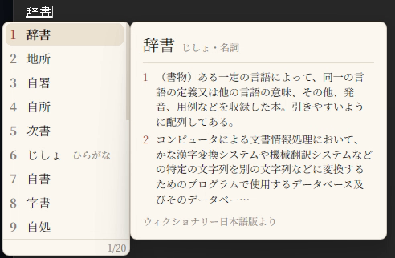
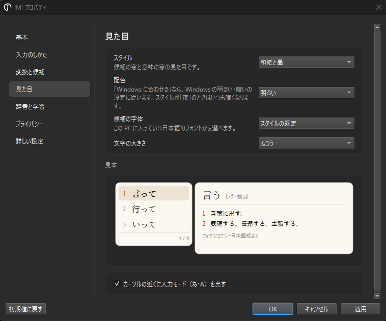

# IMi

打つそばから漢字かな交じりに変換していく「同時変換」の、Windows 向けの日本語入力（IME）です。前後の語との組み合わせを手がかりに、ある程度まで漢字を選び分けるので、Space で変換し直さずにそのまま Enter で確定できる文が増えます。Google の [Mozc](https://github.com/google/mozc) を元にしています。

| 打った読み | IMi（打ち終えたときの表示） | Mozc（Space で変換） |
| --- | --- | --- |
| せんせいにいってみる | 先生に**言って**みる | 先生に行ってみる |
| きのうはあめがふった | **昨日**は雨が**降った** | 機能は雨が振った |
| わたしはこうかいしたかこのじぶんのおこないについて | 私は**後悔**した過去の自分の行いについて | 私は公開した過去の自分の行いについて |

- **同時変換**：打つそばから変換して表示し、Enter で確定します。候補を選び直したいときだけ Space を押します。
- **近くの語を手がかりに漢字を選ぶ**：入力中の文の前後と、直前に確定した文の語との組み合わせから選び分けます。文の意味まで読み取るわけではないので、取り違えることもあります（そのときは Space で選び直します）。
- **語の意味を表示**：選んでいる候補の意味を横に出します（ウィクショナリー日本語版から作った辞書）。
- **PC の中だけで動く**：通信はしません。入力した内容が外に送られることはありません。

打つそばから変換して表示します（Space を押さずに打った様子）。

候補を選ぶと、その語の意味を横に出します。

## ダウンロードとインストール

対応：Windows 10・11（64ビット）。容量：約 300MB。

1. **[ここを押して IMi をダウンロード](https://github.com/iori3mk/imi-ime/releases/latest/download/IMi.msi)** します（`IMi.msi`、約 100MB）。
2. ブラウザが「一般的にダウンロードされていません」などと警告したら、ダウンロードの一覧の「…」→「保持する」を押します（さらに確認が出たら「詳細表示」→「保持する」）。
3. ダウンロードした `IMi.msi` を開きます（ブラウザのダウンロードの一覧か、「ダウンロード」フォルダーにあります）。
4. 「Windows によって PC が保護されました」と出たら、「**詳細情報**」→「**実行**」を押します。
5. 「このアプリがデバイスに変更を加えることを許可しますか？」と出たら、「**はい**」を押します。
6. インストールが終わったら、PC を再起動します。

2・4・5 の警告は、インストーラーに電子署名（発行元の証明）を付けていないために出ます（署名は当面対応しません）。

## 使い方

- タスクバーの入力方式（「あ」「A」）か `Windows キー + Space` で IMi を選びます。
- 打つと同時に変換されます。Enter で確定、Space で候補を選び直します。
- 無変換キーで半角英数、変換キーでひらがな（何も入力していないときは、無変換で IME オフ、変換で IME オン）。
- 設定は、タスクバーの入力方式（「あ」）を右クリックして「プロパティ」から開きます。
- いつも IMi で始めるには、設定の「基本」のページの「既定にする」を押します。
- 動作が重いときは、設定の「基本」のページの「前後の文脈で漢字を選び直す」を切ると軽くなります。
- 新しい版があるかは、設定の「基本」のページの「新しい版を確かめる」で、リリースのページを開いて確かめられます。

設定の「見た目」のページでは、候補の窓と意味の窓のスタイル・配色・字体・大きさを、見本を見ながら選べます。

アンインストールは「設定」→「アプリ」→「インストールされているアプリ」の「IMi」からです。

## ライセンス

ソースコードは BSD 3-Clause です（IMi で加えた部分：Copyright 2026 iori、元の Mozc：Copyright Google。[LICENSE](LICENSE)）。誰でも使う・改造する・配ることができます。配るときは、著作権の表示とライセンスの文を残してください。

同梱の外部のもの（Qt、ONNX Runtime、小型言語モデル、SudachiDict、Wikipedia・Tatoeba・ウィクショナリーから作った表と辞書）には、それぞれの条件があります（[imi/NOTICE.md](imi/NOTICE.md)）。表と語の意味の辞書は CC BY-SA です。

開発者向けの説明は [imi/DEVELOP.md](imi/DEVELOP.md) にあります。
